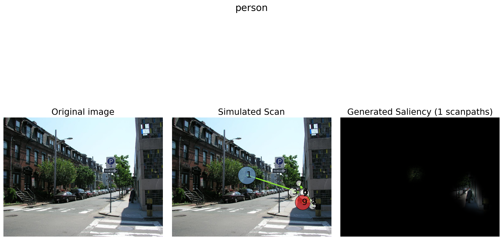
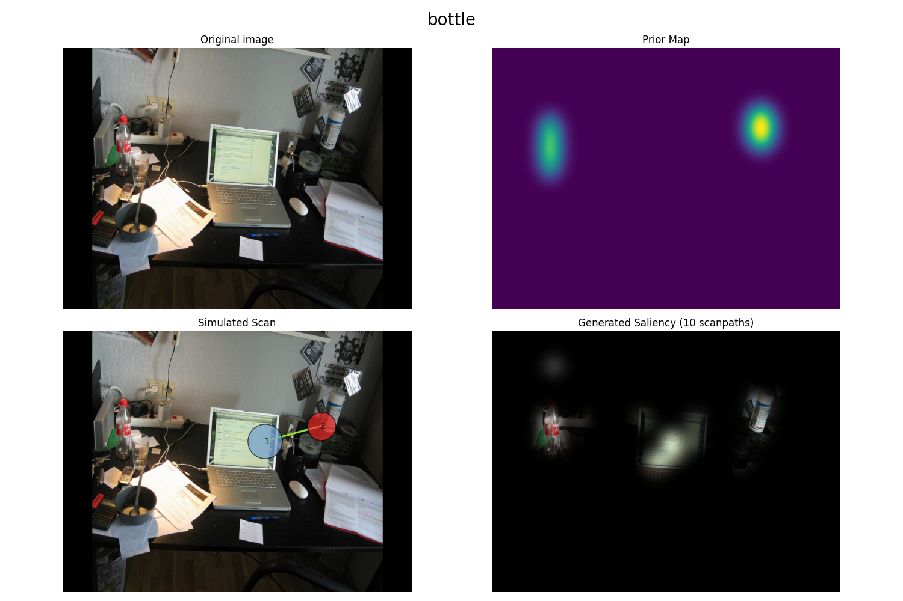
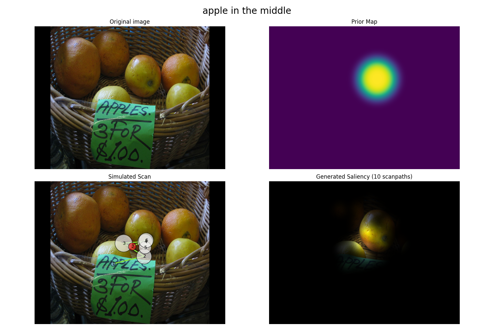
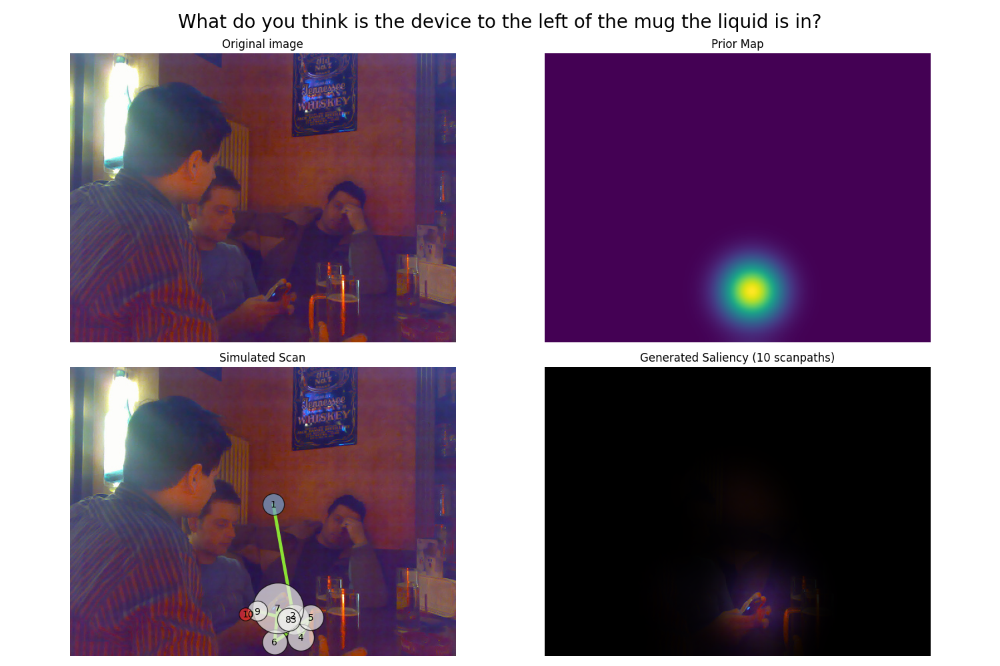
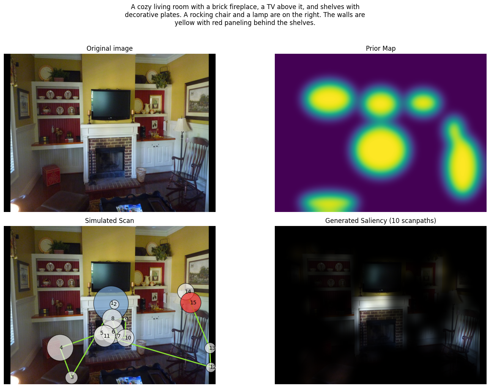

# reasonGaze

**Zero-shot goal-directed visual attention via reasoning chains and neurodynamics.**

When humans search for something in a scene, their gaze is not random — it is shaped by language, reasoning, and prior knowledge. *reasonGaze* models this computationally: given an image and a natural language goal (e.g., *"find the bottle"*, *"What is to the left of the mug?"*), it generates realistic scanpaths that simulate how humans explore the scene.

Built on [ScanDDM](https://github.com/phuselab/scanDDM) (ECCV Workshop 2024), replacing the CLIP-based segmentation backend with [VisionReasoner](https://github.com/dvlab-research/Seg-Zero) (Qwen2.5-VL + SAM2). The key contribution: instead of matching image regions to text embeddings, the model first *reasons* about the scene in natural language — identifying the target, comparing candidates, resolving ambiguities — before allocating attention.

---

## How It Works

```
Image + Prompt
    → Qwen2.5-VL (chain-of-thought reasoning)
    → bounding boxes + reasoning trace
    → SAM2 / ellipse mask → saliency map
    → Race Drift-Diffusion Model
    → simulated scanpath
```

The reasoning chain is explicit and inspectable — the model explains *why* it attends to a region before committing to it.

---

## Example

**Task**: *"person"*

<p align="center">
  
</p>

VisionReasoner localizes the target via chain-of-thought reasoning; the race drift-diffusion model then generates a realistic fixation sequence over the saliency map.

---

## Qualitative Results

### COCO-Search-18 — Object Search


### RefCOCO-Gaze — Natural Language Referral


### AiR-D — Visual Question Answering


### COCO-FreeView — Free Viewing


---

## Benchmark Results

Evaluated on four eye-tracking datasets against human-human inter-subject agreement (instance-level semantic metrics throughout).

### Cross-Dataset Summary

| Dataset | Task type | ScanMatch | sem_ss | Human baseline |
|---------|-----------|:---------:|:------:|:--------------:|
| COCO-Search-18 | Single word search | 0.470 | 0.455 | 0.529 / 0.533 |
| RefCOCO-Gaze | Natural language referral | 0.400 | 0.387 | 0.494 / 0.490 |
| AiR-D | VQA reasoning | 0.405 | 0.251 | 0.480 / 0.285 |
| COCO-FreeView | Free-viewing (VLM captions) | 0.328 | 0.419 | 0.409 / 0.473 |

reasonGaze reaches **80–89% of human-human ScanMatch** and **79–89% of human-human semantic similarity** across all task types — zero-shot, no task-specific training.

### COCO-Search-18 — Object Search (n=326 images)

| Model | ScanMatch | sem_ss | sem_fed ↓ |
|-------|:---------:|:------:|:---------:|
| Human-Human | 0.529 ± 0.072 | 0.533 ± 0.116 | 2.32 ± 1.37 |
| **reasonGaze (SegZero)** | **0.470 ± 0.075** | **0.455 ± 0.114** | **2.52 ± 1.03** |
| CLIPSeg (baseline) | 0.455 ± 0.097 | 0.441 ± 0.125 | 2.56 ± 1.04 |

### AiR-D — Visual Question Answering (n=133 pairs)

| Model | ScanMatch | sem_ss | sem_fed ↓ |
|-------|:---------:|:------:|:---------:|
| Human-Human | 0.480 ± 0.073 | 0.285 ± 0.068 | 9.14 ± 1.16 |
| **reasonGaze (SegZero)** | **0.405 ± 0.106** | **0.251 ± 0.073** | **9.18 ± 0.92** |
| CLIPSeg (baseline) | 0.360 ± 0.116 | 0.231 ± 0.081 | 9.26 ± 0.95 |

### RefCOCO-Gaze — Natural Language Referral (n=203 pairs)

| Model | ScanMatch | sem_ss | sem_fed ↓ |
|-------|:---------:|:------:|:---------:|
| Human-Human | 0.494 ± 0.062 | 0.490 ± 0.082 | 5.66 ± 2.03 |
| **reasonGaze (SegZero)** | **0.400 ± 0.082** | **0.387 ± 0.087** | **6.08 ± 1.70** |
| CLIPSeg (baseline) | 0.343 ± 0.110 | 0.335 ± 0.112 | 6.50 ± 1.84 |

---

## Metrics

| Metric | Description | Range |
|--------|-------------|-------|
| **ScanMatch** | Sequence alignment (spatial + temporal) | 0–1 ↑ |
| **MultiMatch** | Shape, direction, length, position, duration similarity | 0–1 ↑ |
| **sem_ss** | Semantic Sequence Score — fixations mapped to panoptic object IDs, compared with string matching | 0–1 ↑ |
| **sem_fed** | Semantic Fixation Edit Distance (Levenshtein on semantic ID strings) | ≥0 ↓ |

Semantic metrics require COCO panoptic annotations and measure whether the model attends to the *semantically correct* objects — not just the right spatial region.

---

## Installation

```bash
pip install -r requirements.txt
```

### VisionReasoner Model

Download [VisionReasoner-7B](https://github.com/dvlab-research/Seg-Zero) (~24GB VRAM), then set the path:

```bash
export REASONGAZE_MODEL_PATH=/path/to/VisionReasoner-7B
```

---

## Usage

Edit `main.py` to set your image path and prompt:

```python
image_path = "data/example.jpg"
prompt = ["person"]
```

Then run:

```bash
python main.py
```

---

## Repository Structure

```
reasonGaze-standalone/
├── main.py              # Entry point
├── scanDDM.py           # Core model (from phuselab/scanDDM, backend swapped)
├── segzero.py           # VisionReasoner backend (Qwen2.5-VL + SAM2)
├── pixel_race_mcDDM.py  # Race DDM model
├── race_model.py        # Base DDM
├── vis.py               # Visualization
├── requirements.txt
├── data/
│   └── example.jpg
└── examples/            # Qualitative results
    ├── simulation_gif.gif
    ├── coco_segzero.png
    ├── refcoco_segzero.png
    ├── aird_segzero.png
    └── freeview_segzero.png
```

The only modification to the original ScanDDM is replacing `zs_clip_seg.py` with `segzero.py`.

---

## Citation

If you use this work, please cite:

```bibtex
@InProceedings{scanddm2025,
  author="D'Amelio, Alessandro and Lucchi, Manuele and Boccignone, Giuseppe",
  title="ScanDDM: Generalised Zero-Shot Neuro-Dynamical Modelling of Goal-Directed Attention",
  booktitle="Computer Vision -- ECCV 2024 Workshops",
  year="2025",
  publisher="Springer Nature Switzerland",
  pages="234--244"
}
```

If you use the SegZero backend, please also cite:

```bibtex
@article{liu2025segzero,
  title={Seg-Zero: Reasoning-Chain Guided Segmentation via Cognitive Reinforcement},
  author={Liu, Yuqi and Peng, Bohao and Zhong, Zhisheng and Yue, Zihao and Lu, Fanbin and Yu, Bei and Jia, Jiaya},
  journal={arXiv preprint arXiv:2503.06520},
  year={2025}
}
```

## License

MIT — see [LICENSE](LICENSE)
